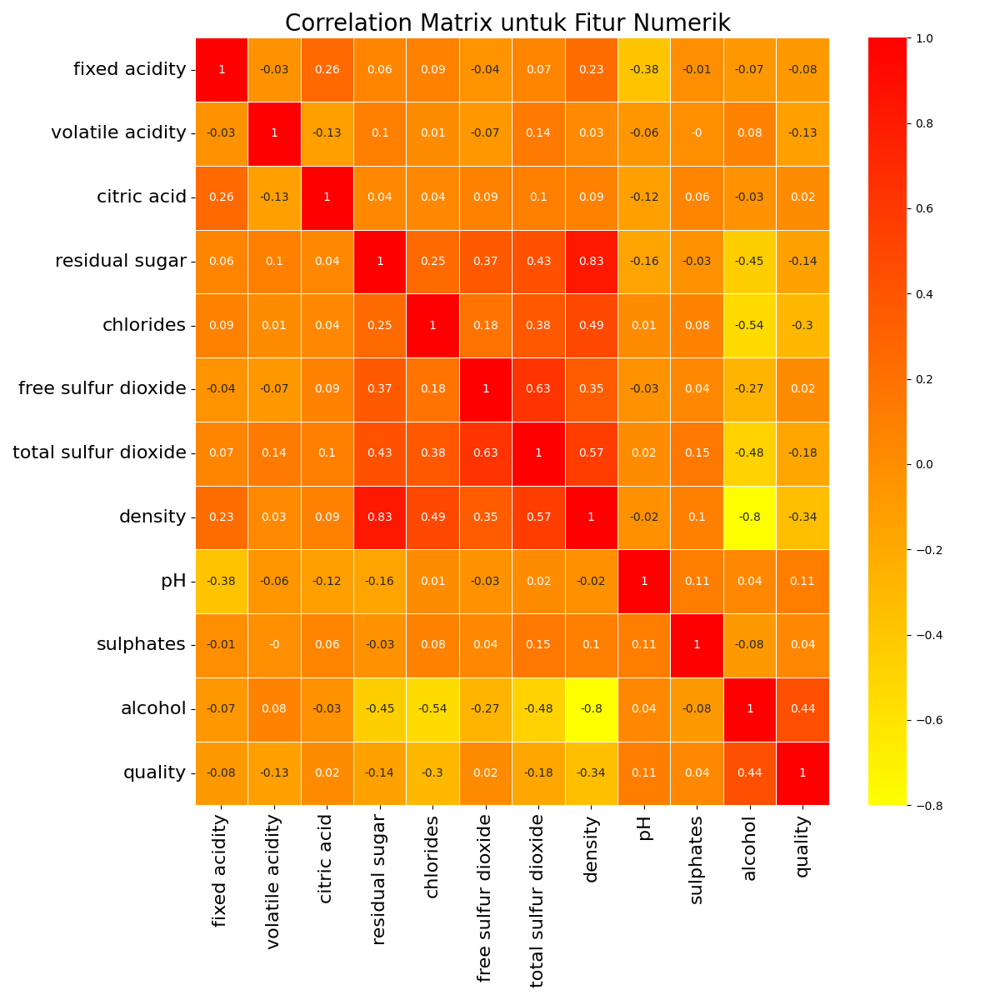
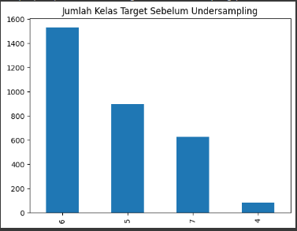
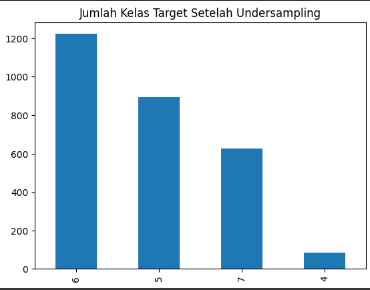
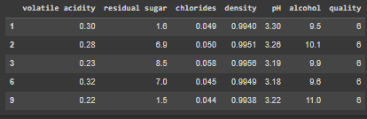
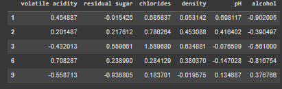

# Predictive Analysis, Prediksi Kualitas *White-wine*

## Latar Belakang
Anggur atau *wine* adalah minuman beralkohol yang terbuat dari fermentasi anggur atau buah-buahan lain. Karena adanya keseimbangan kimia alami, anggur dapat berfermentasi tanpa tambahan gula, asam, enzim, air, atau nutrisi lainnya. Dalam proses fermentasi, ragi akan mengonsumsi kandungan gula dari anggur dan mengubahnya menjadi etanol serta karbon dioksida. Variasi yang berbeda dari jenis anggur dan ragi akan menghasilkan jenis *wine* yang berbeda [1].

*White-Wine* adalah *wine* yang dibuat dari anggur putih (white grape). Beberapa jenis anggur putih yang terkenal di kalangan peminum *wine* di Indonesia adalah chardonnay, sauvignon blanc, semillon, riesling, dan chenin blanc [1].

Meskipun *white-wine* bukan merupakan minuman tradisional ataupun minuman yang populer di Indonesia dan Asia. *white-wine* telah berhasil menarik banyak penggemar wine di indonesia. Popularitas *white-wine* mungkin tidak terlalu baik di wilayah yang terkenal dengan beragam jenis minuman, namun *white-wine* telah berhasil menemukan pasarnya tersendiri. Namun, daya tarik white wine tidak hanya sekadar untuk dikonsumsi, tetapi juga untuk penilaian kualitasnya.

Kualitas *white-wine* mengacu pada faktor-faktor yang digunakan untuk memproduksi *white-wine*, serta indikator atau karakteristik yang menunjukkan apakah *white-wine* tersebut berkualitas tinggi [4]. Prediksi kualitas *white-wine* merupakan hal yang penting baik untuk pengoleksi *white-wine* dan juga para profesional pembuat *white-wine*. bagi para pengoleksi *white-wine* prediksi kualitas *white-wine* akan sangat berguna dikarenakan mereka bisa berada di posisi yang baik untuk melakukan pembelian *white-wine*. Selain itu dengan meningkatnya permintaan *white-wine* berkualitas tinggi, penilaian kualitas *white-wine* yang akurat sangat penting bagi para profesional pembuat *white-wine* untuk mempertahankan reputasi mereka dan memenuhi harapan konsumen.

Oleh karena itu pada proyek ini kita akan membuat sebuah sistem prediksi menggunakan algoritma Machine learning untuk memprediksi kualitas dari *white-wine*.

## Business Understanding

### Problem Statements

Berdasarkan Latar belakang masalah tersebut, dikembangkan sebuah sistem prediksi kualitas *white-wine* untuk menjawab permasalahan berikut.

1. Fitur apa yang paling berpengaruh pada kualitas *white-wine*
2. Bagaimana kualitas *white-wine* berdasarkan fitur - fitur tertentu

### Goals

Adapun tujuan dibuatnya prediksi kualitas *white-wine* adalah sebagai berikut:

1. Mengetahui fitur yang paling mempengaruhi kualitas dari *white-wine*
2. Membuat model machine learning yang dapat memprediksi kualitas *white-wine* seakurat mungkin berdasarkan fitur-fitur yang ada.

### Solution Statements

- Prediksi kualitas *white-wine* dapat diselesaikan dengan model regresi, di mana tujuan dari model regresi adalah untuk memprediksi nilai numerik kontinu (skor kualitas) berdasarkan fitur input yang terkait dengan sifat *white-wine*. Regresi adalah pendekatan yang cocok untuk masalah ini diakarenakan berfokus pada pemodelan hubungan antara variabel input dan variabel target, sehingga kita dapat membuat prediksi yang berada dalam rentang yang kontinu.

- Metrik yang digunakan untuk mengevaluasi seberapa akurat prediksi yang dibuat adalah Mean Absolute Error(MSE). Mean Absolute Error (MAE) adalah salah satu metrik evaluasi untuk mengukur seberapa dekat prediksi model regresi yang kita buat(y predict) terhadap nilai sebenarnya (y). MAE mengukur rata-rata selisih absolut antara nilai prediksi dan nilai sebenarnya.

- Pengembangan model akan menggunakan beberapa algoritma regresi diantaranya adalah: *K-Nearest Neighbor* (KNN), *Support Vector Regression*(SVR), dan *Boosting Algorithm*. Dari ketiga model ini, akan dipilih satu model yang memiliki nilai mae paling kecil dan waktu pelatihan yang singkat selain itu juga dipertimbangkan masalah overfitting yaitu model yang terlalu yang terlalu akurat pada data training namun tidak bisa menggeneralisir pola sehingga model tidak bisa bekerja dengan baik pada data yang tidak pernah dilihat sebelumnya yaitu data test.

## Data Understanding

Berikut adalah informasi umum mengenai dataset yang digunakan:

<table border>
  <tr>
    <td>Sumber Dataset</td>
    <td>UCI Machine Learning Repository: <a href ="https://archive.ics.uci.edu/dataset/186/*white-wine*+quality">Link</a></td>
  </tr>
  <tr>
    <td>Nama Dataset</td>
    <td>wine quality</td>
  </tr>
  <tr>
      <td>Area subjek</td>
      <td>Bisnis</td>
  </tr>
  <tr>
      <td>Masalah Terkait</td>
      <td>Klasifikasi dan Regresi</td>
  </tr>

  <tr>
      <td>Jumlah Atribut/fitur</td>
      <td>12</td>
  </tr> 
  <tr>
      <td>Jumlah Instance</td>
      <td>4898</td>
  </tr> 
</table>

### Deskripsi Variabel

Pada berkas yang diunduh terdapat dua dataset yaitu winequality-red.csv dan winequality-white.csv namun dikarenakan pada project ini kita hanaya menyelesaikan masalah prediksi kualitas *white-wine* bukan untuk mengklasifikasikan red-wine dan *white-wine* maka kedua kita hanya akan menggunakan winequality-red.csv. dataset tersebut memiliki 4898 baris dan 12 kolom berikut adalah informasi mengenai atribut/fitur pada dataset.

<table border>
    <tr>
        <th>Fitur</th>
        <th>Penjelasan</th>
    </tr>
    <tr>
        <td><strong>Fixed Acidity</strong> (Kekuatan Asam Tetap)</td>
        <td>Kekuatan asam non-volatil dalam <i>white-wine</i>. Berkontribusi pada keasaman keseluruhan dan profil rasa <i>white-wine</i>.</td>
    </tr>
    <tr>
        <td><strong>Volatile Acidity</strong> (Kekuatan Asam Volatil)</td>
        <td>Kekuatan asam yang mudah menguap dalam <i>white-wine</i>. Kadar kekuatan asam volatil yang tinggi dapat menghasilkan rasa cuka dan berdampak negatif pada kualitas <i>white-wine</i>.</td>
    </tr>
    <tr>
        <td><strong>Citric Acid</strong> (Asam Sitrat)</td>
        <td>Kandungan asam sitrat dalam <i>white-wine</i> yang mempengaruhi tingkat keasaman dan kesegarannya.</td>
    </tr>
    <tr>
        <td><strong>Residual Sugar</strong> (Sisa Gula)</td>
        <td>Jumlah gula yang tersisa dalam <i>white-wine</i> setelah fermentasi. Mempengaruhi tingkat manis dan keseimbangan <i>white-wine</i>.</td>
    </tr>
    <tr>
        <td><strong>Chlorides</strong> (Klorida)</td>
        <td>Konsentrasi garam, khususnya klorida, dalam <i>white-wine</i> yang mempengaruhi rasa dan persepsi keseluruhan.</td>
    </tr>
    <tr>
        <td><strong>Free Sulfur Dioxide</strong> (Sulfur Dioksida Bebas)</td>
        <td>Jumlah sulfur dioksida bebas dalam <i>white-wine</i>. Sulfur dioksida sering ditambahkan sebagai pengawet.</td>
    </tr>
    <tr>
        <td><strong>Total Sulfur Dioxide</strong> (Total Sulfur Dioksida)</td>
        <td>Jumlah total sulfur dioksida dalam <i>white-wine</i>, termasuk bentuk bebas dan terikat.</td>
    </tr>
    <tr>
        <td><strong>Density</strong> (Kepadatan)</td>
        <td>Massa <i>white-wine</i> per unit volume. Dipengaruhi oleh kandungan gula dan tingkat alkohol.</td>
    </tr>
    <tr>
        <td><strong>pH</strong></td>
        <td>Tingkat keasaman <i>white-wine</i> yang memengaruhi stabilitas, rasa, dan keseimbangan <i>white-wine</i>.</td>
    </tr>
    <tr>
        <td><strong>Sulphates</strong> (Sulfat)</td>
        <td>Konsentrasi senyawa sulfur yang ditambahkan sebagai zat pengawet.</td>
    </tr>
    <tr>
        <td><strong>Alcohol</strong> (Alkohol)</td>
        <td>Kandungan alkohol dalam <i>white-wine</i> yang memengaruhi keberanian, rasa, dan rasa panas <i>white-wine</i>.</td>
    </tr>
    <tr>
        <td><strong>Quality</strong> (Kualitas)</td>
        <td>Peringkat kualitas <i>white-wine</i></td>
    </tr>
</table>

### Menangani Missing Value dan Outliers

#### Menangani Missiing Value

berdasarkan informasi dari sumber dataset yaitu UCI Machine Learning Repository dataset tidak memiliki missing value. Oleh karena itu, tidak ada penanganan khusus terhadap missing value. 

#### Menangani Outliers 

Untuk mengetahui apakah terdapat outlier pada dataset dilakukan visualisasi menggunakan boxplot untuk demua fitur yang ada pada dataset.

berdasarkan visualisasi diatas ditemukan beberapa outlier pada dataset untuk menangani outlier tersebut kita bisa menggunakan IQR method.

IQR sangat berguna dalam menemukan outlier, yang merupakan nilai yang secara signifikan berbeda dari data lainnya. Kita dapat menggunakan IQR untuk mengidentifikasi outlier dengan mempertimbangkan nilai yang berada di bawah kuartil pertama (Q1) atau di atas kuartit ketiga (Q3). Nilai apa pun di luar batas-batas ini dianggap sebagai outlier. 

berikut adalah visualisasi boxplot setelah dilakukan pembersihan outlier

visualisasi tersebut menunjukan bahwa sudah tidak terdapat lagi outlier pada dataset.

### Univariate Analysis

Untuk menganalisis dan untuk mengetahui persebebaran data pada setiap fitur dalam dataset *white-wine* kita akan melihat histogram masing-masing fiturnya.

Berdasarkan Histogram tersebut dapat disimpulkan banyak informasi diantaranya:

1. distribusi data tingkat kekuatan asam yang tidak volatile(fixed acidity) bersifat normal (bell curved ) dimana nilai median dan rata-ratanya hampir sama. sehingga dapat disimpulkan jika rata-rata *white-wine* memiliki tingkat kekuatan asam sekitar nilai median yang diperkirakan sekitar 6.8.

2. distribusi data tingkat kekuatan asam volatile(volatile acidity) bersifat normal (bell curved ) dimana nilai median dan rata-ratanya hampir sama. sehingga dapat disimpulkan jika rata-rata *white-wine* memiliki tingkat kekuatan asam sekitar nilai median yang diperkirakan sekitar 0.26.

3. Distribusi data tingkat asam sitrat juga bersifat normal (bell curved ) dimana nilai median dan rata-ratanya hampir sama. sehingga dapat disimpulkan jika rata-rata *white-wine* memiliki kadar asam sitrat sekitar nilai mediannya yang diperkirakan sekitar 0.31. namun terdapat peak yang akan mempengaruhi nilai rata ratanya. tapi peak tersebut hanya satu sehingga nilai rata-rata pun tidak terlalu berpengaruh.

4. Tingkat residual sugar atau gula tersisa dalam *white-wine* kebanyakan rendah hal ini dikarenakan frekuensi dari *white-wine* yang memiliki residual sugar rendah sangat tinggi sehingga bisa disimpulkan kebanyakan *white-wine* tidak begitu manis.

5. tingkat konsentrasi cloride atauu klorida dalam *white-wine* kebanyakan berada disekitar 0.03 sampai 0.05.

6. Distribusi data Jumlah sulfur dioksida bebas dalam *white-wine* tidak terdistribusi secara seragam hal ini dibuktikan dengan banyaknya peak dalam histogram.

7. Distribusi data total sulfur dioksida dalam *white-wine* juga bersifat normal (bell curved ) dimana nilai median dan rata-ratanya hampir sama. sehingga dapat disimpulkan jika rata-rata total sulfur dioksida dalam *white-wine* sekitar nilai mediannya yang diperkirakan sekitar 125.

8. Density atau massa jenis dari *white-wine* berada antara 0.998 dan 1.

9. pH dari *white-wine* kebanyakan berada sekitar 3.0 - 3.4.

10. kebanyakan white wine memiliki kadar senyawa sulfat sekitar 0.49 - 50.

11. Kebanyakan dari *white-wine* memiliki tingkat alkohol sekitar 9.5 dan sangat sedikit sekali *white-wine* yang memiliki tingkat alkohol dibawah 9 dan diatas 13.

12. Tingkat kualitas dari *white-wine* sebenarnya berada antara 4-9 namun dikarenakan *white-wine* yang memliki kualitas 8 dan 9 sangatlah sedikit maka tingkat kualitas tersebut dianggap outlier. sehingga kualitas *white-wine* pada data hanya dari 4 - 7
dimana kebanyakn *white-wine* memiliki kualitas 6.

### Multivariate Analysis

Multivariate EDA menunjukkan hubungan antara dua atau lebih variabel pada data. Untuk mengamati hubungan antara fitur dalam dataset, kita akan menggunakan fungsi pairplot().

hasil visualisasi tersebut menunjukan jika tidak ada fitur yang berkorelasi tinggi dengan fitur target yaitu `quality` atau kualitas *white-wine*.

Untuk lebih mendalam memahami korelasi antar fitur digunakan Parameter correlation. Parameter ini digunakan untuk mengidentifikasi korelasi atau hubungan dari dua feature numerik dalam sebuah data. Korelasi ini digambarkan menggunakan nilai dengan rentang -1 hingga 1.

Pada parameter correlation, nilai negatif menggambarkan korelasi berlawanan (negative correlation), sedangkan nilai positif merepresentasikan korelasi bersesuaian (positive correlation). Jika correlation dari dua feature bernilai nol, keduanya dinyatakan tidak memiliki korelasi (no correlation)[2].

Banyak fitur yang kurang berkorelasi dengan fitur target sehingga kita bisa menghapus fitur-fitur tersebut namun fitur yang dihapus hanya fitur yang korelasinya kurang dari 0.1 atau -0.1 hal ini dikarenakan jika kita menghapus banyak fitur tentunya kita akan kehilangan informasi yang mungkin berguna dari fitur tersebut. fitur tersebut diantaranya adalah fixed acidity, citric acid, sulphates, free sulfur dioxide, total sulfur dioxide. sehingga fitur yang tersedia adalah volatile acidity, residual sugar, chlorides	density, pH, dan alcohol.

## Data preparation

Pada tahap ini kita akan membuat data menjadi lebih mudah untuk diproses oleh model Machine Learning. Pada tahap ini kita akan melakukan 2 hal yaitu membagi data menjadi data training dan data test. selanjutnya kita akan melakukan *feature scaling* menggunakan standard scaler.

### Undersampling
Berdasarkan analisis sebelumnya diketahui bahwa jumlah frekuensi data pada fitur target tidak seimbang.

ini akan berpengaruh dengan kinerja model. model akan terlalu sensitif terhadap data yang memiliki fitur target dengan frekuensi terbanyak, sehingga kita bisa mengurangi jumlah data dengan fitur target yang frekuensinya paling banyak/mayoritas (undersampling). kita akan menghapus 20% dari mayoritas kelas target sehingga kelas target cukup seimbang berikut adalah jumlah fitur target setelah dilakukan undersampling.

### Train Test Split

Sebelum dilakukan *feature scaling* seperti normalisasi ataupun standarisasi terlebih dahulu kita bagi terlebih dahulu dataset menjadi 2 bagian yaitu data train dan data test. proporsi yang digunakan dalam pembagian ini adalah  80:20 yang artinya 80% dari data akan dijadikan training set atau data yang digunakan untuk melatih model, dan 20 % dari data akan dijadikan test set atau data yang digunakan untuk menguji model. data-data tersebut tidak dipilih secara acak melainkan kita akan mengambil 80% data pertama sebagai data training dan sisanya akan dijadikan sebagai data test.

### Standarisasi 

*Feature scaling* yang digunakan adalah standard scaler. StandardScaler melakukan proses standarisasi fitur dengan mengurangkan mean (nilai rata-rata) kemudian membaginya dengan standar deviasi untuk menggeser distribusi.  StandardScaler menghasilkan distribusi dengan standar deviasi sama dengan 1 dan mean sama dengan 0. Sekitar 68% dari nilai akan berada di antara -1 dan 1 [3]. berikut adalah 10 data pertama sebelum dilakukan standarisasi dan setelah dilakukan standarisasi.

- sebelum di standarisasi

- setelah distandarisasi

Sebelum masuk tahap modelling mari kita recap apa yang sudah kita lakukan pada tahap data preparation dan data understanding:
1. Fitur yang dipilih untuk dimasukan ke model adalah fitur yang cukup berkorelasi dengan kelas target yaitu volatile acidity, residual sugar, chlorides	density, pH, dan alcohol.
2. Menghapus 20% data dari kelas mayoritas (Undersampling).
3. Membagi data menjadi data train dan data test dimana data train diambil dari mengambil 80% data pertama sebagai data training dan sisanya akan dijadikan sebagai data test.
4. Melakukan standarisasi terhadap data sehingga  Sekitar 68% dari nilai akan berada di antara -1 dan 1.

## Modeling

Seperti yang dijelaskan pada tahap Business Understanding kita akan mengembangkan model machine learning dengan tiga algoritma yang berbeda. Kemudian, kita akan membandingkan mean absolute error dan waktu training masing-masing algoritma dan menentukan algoritma mana yang memberikan hasil prediksi terbaik. Ketiga algoritma tersebut antara lain:

1. *K-Nearest Neighbor* (KNN)
2. *Support Vector Regression* (SVR)
3. *Boosting Algorithm*

### *K-Nearest Neighbor*

Pertama kita akan membuat model *machine learning* dengan menggunakan algoritma KNN 

Kita menggunakan paremeter k = 10 tetangga dan metric default atau bawaan dari sklearn yaitu Euclidean selanjutnya kita melatih model tersebut dengan data train yang sudah kita siapkan sebelumnya. 

kemuadian waktu dari training model akan disimpan dalam dataframe yang sudah dibuat sebelumnya yang nantinya akan digunakan untuk membandingkan algoritma mana yang paling cepat.

Selanjutnya kita akan menyimpan hasil prediksi dari model untuk kemudian dilakukan evaluasi terhadap model pada tahap evaluasi 

### SVR

Kedua kita akan membuat model *machine learning* dengan menggunakan algoritma SVR

parameter yang digunakan antara lain adalah sebagai berikut:

- Kernel, Kernel adalah fungsi yang digunakan untuk mengukur seberapa mirip dua titik data dalam ruang fitur yang lebih tinggi: kernel yang digunakam adalah kernel rbf
- Parameter C Parameter C mengendalikan trade-off antara error pelatihan dan kompleksitas model: parameter c yang digunakan adalah 100
- Parameter gamma Parameter gamma mengontrol seberapa banyak pengaruh satu titik data tunggal: parameter gamma yang digunakan adalah 0.1

Selanjutnya kita akan menyimpan waktu training dari model untuk kemudian dilakukan evaluasi terhadap model pada tahap evaluasi.

### *Boosting Algorithm*

Terakhir kita akan membuat model *Machine learning* dengan *Boosting Algorithm*

Parameter yang digunakan antara lain adalah 

- learning_rate bobot yang diterapkan pada setiap regressor di masing-masing proses iterasi boosting : learning rate yang digunakan adalah 0.05
- random_state: digunakan untuk mengontrol random number generator yang digunakan:random_state yang digunakan adalah 123

sama seperti sebelumnya kita akan menyimpan waktu training dari model untuk kemudian dilakukan evaluasi terhadap model pada tahap evaluasi.

## Evaluasi

Setelah dilakukan pelatihan terhadap ketiga model *machine learning* kita akan mencari model yang memiliki performa terbaik yaitu waktu pelatihan yang relatif singkat dan error yang paling minim dari ketiga model.

### Mean Absolute Error (MAE) Model

Mean Absolute Error (MAE) adalah salah satu metrik evaluasi untuk mengukur seberapa dekat prediksi model regresi yang kita buat(y predict) terhadap nilai sebenarnya (y). MAE mengukur rata-rata selisih absolut antara nilai prediksi dan nilai sebenarnya. berikut adalah formula untuk menghitung MAE.

Berikut adalah MAE ketiga model *machine learning* yang telah kita buat:

Berdasarkan nilai-nilai MAE di atas, kita dapat menyimpulkan beberapa hal:

- Model SVM memiliki performa yang lebih baik daripada model KNN dan Boosting pada data training Ini ditunjukkan oleh fakta bahwa nilai MAE untuk SVM lebih rendah daripada nilai MAE untuk model lainnya. namun model ini mengalami *overfitting* yang ditandai dengan error yang lebih tinggi pada data test

- Model Boosting memiliki MAE yang lebih rendah pada data testing dari kedua model, namun model ini memiliki  MAE yang lebih tinggi pada data training dibandingkan kedua model.

- Model KNN 
Model KNN memiliki MAE kedua terendah setelah model SVM pada data training dan model ini juga memiliki selisih yang tipis dengan model yang memiliki MAE terendah yaitu boosting

Kita ingin memilih model yang memiliki kestabilan antara performa pada data training dan testing, oleh karena itu model KNN menjadi pilihan yang sesuai. Meskipun model Boosting memiliki nilai MAE terendah pada data testing, tetapi memiliki perbedaan yang signifikan antara performa pada data training dan testing, menunjukkan adanya underfitting. Di sisi lain, model KNN memiliki performa yang baik pada kedua data, training dan testing, dengan selisih yang lebih sedikit antara nilai-nilai MAE, menunjukkan kestabilan yang lebih baik dalam generalisasi ke data yang tidak dilihat sebelumnya.

### Waktu training Model
Berikut adalah waktu yang dibutuhkan untuk melatih ketiga model machine learning yang telah kita buat:

Model KNN memiliki waktu training yang sangat singkat dibandingkan dengan kedua model lainnya. Model Boosting memiliki waktu training kedua lebih cepat dibandingkan SVM sedangkan model SVM memiliki waktu yang jauh lebih lama dibandingkan 2 model lainnya.

## Kesimpulan
- Tidak ada fitur yang berkorelasi tinggi dengan kelas target yaitu quality atau kualitas wine. namun terdapat fitur yang cukup berkorelasi dengan kualitas white-wine diantaranya adalah fitur 
volatile acidity, residual sugar, chlorides	density, pH, dan alcohol.

- Setelah membandingkan akurasi dan juga waktu training model dapat disimpulkan jika model terbaik untuk memprediksi kualitas *white-wine* adalah model KNN. model KNN tidak hanya menawarkan kestabilan antara performa pada data training dan testing, tetapi juga menjadi pilihan yang cepat dalam hal eksekusi. Ini menjadikannya solusi yang baik jika kita ingin mendapatkan hasil yang baik dengan waktu eksekusi yang relatif lebih singkat.

## Referensi
[1] https://id.wikipedia.org/wiki/Minuman_anggur  
[2] https://www.dicoding.com/academies/555/tutorials/30365  
[3] https://www.dicoding.com/academies/319/tutorials/18570  
[4] https://www.jjbuckley.com/wine-knowledge/blog/the-4-factors-and-4-indicators-of-wine-quality/1009